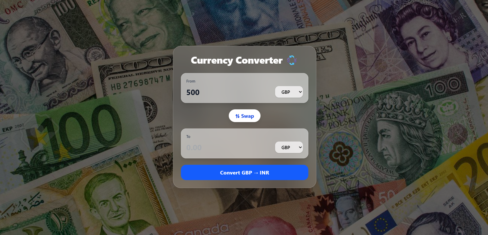

# 💱 Currency Converter Web App

A modern and user-friendly **Currency Converter** web application that allows users to convert values between different international currencies in real time.

---

## 📸 Preview

!


---

## 🚀 Features

- 🌍 Convert between multiple global currencies
- 🔄 Swap currencies instantly
- ⚡ Fast and real-time exchange rates
- 🎨 Clean, modern, and responsive UI
- 💻 Works across desktop and mobile devices

---

## 🛠️ Tech Stack

- **Frontend:** HTML, CSS, JavaScript  
- **Framework/Tooling:** Vite (if used)  
- **API:** Exchange Rate API  
- **Version Control:** Git & GitHub

---
currency-converter/
├── src/
├── public/
├── screenshot.png
├── package.json
├── README.md

---

## ▶️ How to Run Locally

1. Clone the repository
```bash
git clone https://github.com/Adityakr0/currency-converter.git
cd currency-converter
npm run dev

---

## 🚀 Step 3: Push README & Screenshot to GitHub

Run these commands:

```bash
git add README.md screenshot.png
git commit -m "Add README and project screenshot"
git push

## 📂 Project Structure

